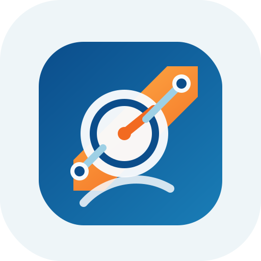
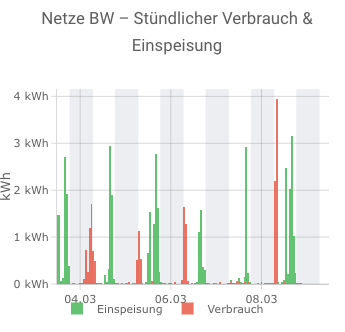

# Netze BW Portal Integration for Home Assistant

<p align="center">
  
</p>

[![GitHub Release][release-badge]][release-url]
[![GitHub Downloads (all assets, all releases)][downloads-badge]][release-url]
[![HACS Custom][hacs-badge]][hacs-url]
[![HA Version][ha-badge]][ha-url]
[![License][license-badge]][license-url]
[![GitHub commit activity][commits-badge]][commits-url]

Home Assistant integration for the [Netze BW portal](https://meine.netze-bw.de) — automatic smart meter discovery, real-time sensors, and up to 30 days of energy history for the Energy Dashboard.

## Features

- Authenticates via username/password against the Netze BW Auth0 login
- Auto-discovers all active IMS (intelligent metering system) meters
- Polls every **6 hours** for fresh data
- Backfills up to **30 days** of daily and hourly consumption history into the HA Energy Dashboard (Long-Term Statistics)
- Incremental history updates — only missing days are re-fetched, not the full window every cycle
- Supports both consumption and feed-in (Einspeisung) meters

## Sensors

Each discovered meter gets the following sensors:

### Energy sensors

| Sensor | Description | Unit | State class |
|---|---|---|---|
| Daily energy | Last reported daily consumption or feed-in from the portal API | kWh | — |
| Daily consumption | Latest daily value from the backfilled history | kWh | Measurement |
| Hourly consumption | Latest hourly value from the backfilled history | kWh | Measurement |
| Total reading | Current cumulative meter reading | kWh | Total increasing |
| 7 day sum | Sum of the last 7 days | kWh | — |
| 30 day sum | Sum of the last 30 days | kWh | — |
| Last measurement date | Timestamp of the last measurement point | — | — |

### Diagnostic sensors

| Sensor | Description |
|---|---|
| Serial number | Meter serial number |
| Metering code | MeLo-ID (formatted in groups of 4) |
| SMGW ID | Smart meter gateway ID |
| Value types | Available measurement value types |
| History status | `ok` / `gaps` / `error` / `disabled` |
| Last daily history point | Timestamp of the newest daily statistic pushed to HA |
| Last hourly history point | Timestamp of the newest hourly statistic pushed to HA |
| Last history backfill | Timestamp of the last successful history fetch |
| Open history gaps | Number of date gaps still missing from the expected window |
| Last data fetch | Timestamp of the last coordinator update |
| Next data fetch | Scheduled time of the next coordinator update |

## Energy Dashboard

Daily and hourly history data is exported as **Long-Term Statistics** under the IDs:

```
netze_bw_portal:<meter_id>_daily
netze_bw_portal:<meter_id>_hourly
```

Add these as an **Electricity grid** or **Solar panels** source in **Settings → Energy** to see up to 30 days of consumption or feed-in history.

On first setup, the integration fetches all 30 days of daily history (one API call) and all 30 days of hourly history (one call per day with a short delay). Subsequent polls only re-fetch the last 2 days (recheck window, because data arrives with a delay) plus any gaps.

## Plotly Graph Example

A ready-to-use [Plotly Graph Card](https://github.com/dbuezas/lovelace-plotly-graph-card) example is included in [`examples/plotly_netze_bw.yaml`](examples/plotly_netze_bw.yaml). It shows hourly consumption and feed-in as stacked bars with night-time shading from the `sun.sun` integration.

<p align="center">
  
</p>

Replace `YOUR_CONSUMPTION_METER_ID` and `YOUR_FEED_IN_METER_ID` with your actual meter IDs from the sensor entity names.

## Installation

### HACS (recommended)

1. Open HACS in your Home Assistant instance
2. Click the three dots in the top right corner and select **Custom repositories**
3. Add this repository URL with category **Integration**
4. Search for **Netze BW Portal** and click **Install**
5. Restart Home Assistant

### Manual

1. Copy the `custom_components/netze_bw_portal` folder into your Home Assistant `config/custom_components/` directory
2. Restart Home Assistant

## Configuration

1. Go to **Settings** > **Devices & Services**
2. Click **Add Integration** and search for **Netze BW Portal**
3. Enter your meine.netze-bw.de email and password
4. Select which meters to monitor and configure history options
5. The integration creates sensors automatically

### Setup options

Configured during initial setup (and adjustable later via **Configure**):

| Option | Default | Description |
|---|---|---|
| Enabled meters | all | Select which meters to track |
| Enable daily history backfill | on | Push daily statistics to the Energy Dashboard |
| Enable hourly history backfill | on | Push hourly statistics to the Energy Dashboard |
| Enable 15-minute history backfill | off | Push 15-minute statistics to the Energy Dashboard |
| History backfill days | 30 | How many days of history to maintain (1–30) |

All options can be changed at any time by clicking **Configure** on the integration card.

## Debug Logging

```yaml
logger:
  logs:
    custom_components.netze_bw_portal: debug
```

## Known Limitations

- Accounts with MFA (multi-factor authentication) or additional interactive login steps are not supported
- Portal data for a given day is typically available with a delay of **1–2 days** — the integration automatically re-checks the last 2 days on every poll cycle to pick up late-arriving data
- Hourly history from the portal is available approximately 6 hours after the end of each hour
- The initial full 30-day hourly backfill makes one API request per day (30 requests total) with a 0.3 s delay between them; this runs once on first setup and after a storage schema migration

## Requirements

- Home Assistant 2025.1.0 or newer
- A registered account at [meine.netze-bw.de](https://meine.netze-bw.de)
- At least one active IMS meter linked to your account

## License

This project is licensed under the MIT License. See [LICENSE](LICENSE) for details.

[release-badge]: https://img.shields.io/github/v/release/cygnusb/ha-netze-bw?include_prereleases
[release-url]: https://github.com/cygnusb/ha-netze-bw/releases
[downloads-badge]: https://img.shields.io/github/downloads/cygnusb/ha-netze-bw/total
[hacs-badge]: https://img.shields.io/badge/HACS-Custom-41BDF5.svg
[hacs-url]: https://hacs.xyz
[ha-badge]: https://img.shields.io/badge/HA-2025.1.0+-blue.svg
[ha-url]: https://www.home-assistant.io/
[license-badge]: https://img.shields.io/github/license/cygnusb/ha-netze-bw
[license-url]: https://github.com/cygnusb/ha-netze-bw/blob/main/LICENSE
[commits-badge]: https://img.shields.io/github/commit-activity/y/cygnusb/ha-netze-bw
[commits-url]: https://github.com/cygnusb/ha-netze-bw/commits/main
